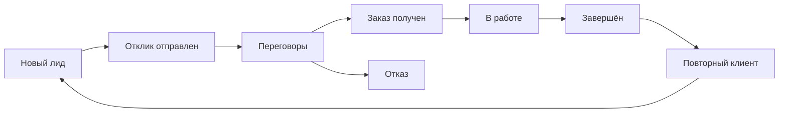
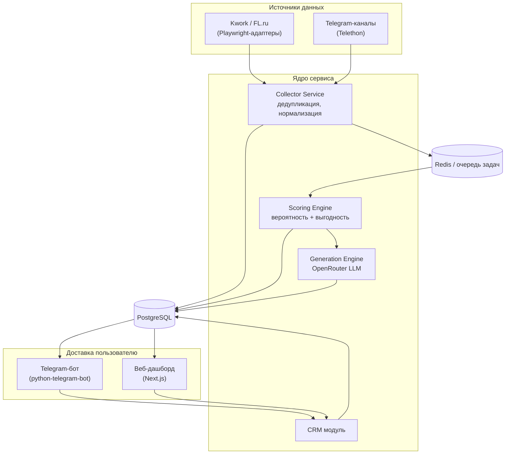

# AGENTS.md — FreelanceRadar

**AI-ассистент фрилансера: мониторинг бирж, скоринг заказов, генерация откликов, CRM.**
Версия документа: 0.1 · Дата: 25 июля 2026 · Статус: pre-MVP, спецификация для разработки

Этот файл — точка входа для любого AI-агента (Claude Code и аналоги), который будет
разрабатывать этот проект. Он же — источник истины по продукту, архитектуре и правилам
работы для человека. Если в подпапке репозитория появится собственный `AGENTS.md` —
он имеет приоритет для этой подпапки, данный файл остаётся источником истины для всего
остального.

Проект — прямое развитие уже существующего сервиса **FreelanceRadar**
(отдельный бот на python-telegram-bot + Telethon + Playwright, сознательно
не объединённый с другими Telegram-ботами в портфолио — общих зависимостей,
БД и деплой-пайплайнов с ними нет). Модуль мониторинга бирж и каналов — это
эволюция уже принятых архитектурных решений, а не решение с нуля.

---

## Оглавление

1. [TL;DR для агента](#1-tldr-для-агента)
2. [О продукте](#2-о-продукте)
3. [Функциональность](#3-функциональность)
4. [Архитектура](#4-архитектура)
5. [Модель данных](#5-модель-данных)
6. [AI / Prompt Engineering](#6-ai--prompt-engineering)
7. [Тарифы и монетизация](#7-тарифы-и-монетизация)
8. [Безопасность и соответствие требованиям](#8-безопасность-и-соответствие-требованиям)
9. [Окружение и команды разработки](#9-окружение-и-команды-разработки)
10. [Стиль кода и git-конвенции](#10-стиль-кода-и-git-конвенции)
11. [Тестирование](#11-тестирование)
12. [Правила работы для AI-агентов](#12-правила-работы-для-ai-агентов)
13. [Метрики успеха](#13-метрики-успеха)
14. [Дорожная карта](#14-дорожная-карта)
15. [Глоссарий](#15-глоссарий)

---

## 1. TL;DR для агента

- **Продукт:** подписочный SaaS (Telegram-бот + веб-дашборд) для фрилансеров:
  мониторинг бирж/каналов → анализ и скоринг проекта → расчёт выгодности →
  генерация отклика → адаптация портфолио → CRM клиентов → напоминания.
- **Стек:** Python 3.11, python-telegram-bot, Telethon, Playwright,
  SQLAlchemy (async) + PostgreSQL, Redis + APScheduler, OpenRouter (LLM-шлюз),
  FastAPI (API дашборда), Next.js + TypeScript + Tailwind (веб).
- **Золотые правила:** реальный `pytest`, никакого кода в чате — только файлы/diff,
  ноль незапрошенных изменений в продакшн-файлах, секреты не коммитятся, отклики
  никогда не выдумывают опыт фрилансера, любое изменение частоты скрапинга/Telethon
  согласуется явно. Подробности — [раздел 12](#12-правила-работы-для-ai-агентов).
- **Не путать с другими ботами в портфолио** (aiogram-проекты) — изолированный
  репозиторий, изолированная БД, отдельный деплой.

---

## 2. О продукте

### 2.1 Проблема

Фрилансер тратит 1–2 часа в день на ручной обход 3–5 бирж и каналов, пропускает
свежие заказы в первые (решающие) минуты после публикации, откликается вслепую —
без понимания реальной вероятности выигрыша и итоговой выгодности заказа после
комиссии площадки и потраченного времени, и теряет клиентов, потому что забывает
написать после паузы в переписке.

### 2.2 Решение

FreelanceRadar снимает рутину квалификации заказов: система сама мониторит источники,
отсеивает нерелевантное, считает вероятность получения заказа и реальную выгодность
в деньгах в час, готовит персонализированный (не шаблонный) отклик с учётом портфолио
пользователя и напоминает написать клиенту, если тот замолчал.

**Позиционирование:** не агрегатор уведомлений и не биржа-конструктор шаблонов —
инструмент принятия решения "откликаться или нет" и "сколько это реально принесёт".

### 2.3 Целевой пользователь (ICP)

Фрилансер или микро-команда (1–3 человека) в RU/СНГ-сегменте, откликающийся на
10–20+ заказов в неделю на 2+ источниках. Продукт **не** предназначен для крупных
агентств с отделом продаж — им нужен B2B CRM с несколькими воронками и ролями, это
отдельная задача вне рамок MVP.

### 2.4 Продуктовые принципы

- Скорость важнее идеальной точности анализа — окно "кто первый откликнулся, тот
  и выиграл" на большинстве бирж короткое (минуты, не часы).
- Отклик должен звучать так, будто его написал человек, прочитавший конкретный заказ,
  а не рассылка.
- **Never fabricate.** Один придуманный факт в отклике — и пользователь перестаёт
  доверять системе навсегда. Портфолио — единственный источник фактов о пользователе.
- Скоринг — это подсказка, а не автопилот. Решение отправлять отклик всегда остаётся
  за пользователем, если явно не включён автоотправка (доступна только на Business).

---

## 3. Функциональность

### 3.1 Мониторинг бирж и каналов

- **Источники MVP:** Kwork, FL.ru, Telegram-каналы с заказами (через Telethon).
- **Источники Фазы 2:** Weblancer, Habr Freelance, опционально Upwork (через
  официальный API — единственный источник без скрапинга).
- Каждый источник — отдельный **адаптер** с единым интерфейсом
  `fetch() -> list[RawListing]`, чтобы добавление нового источника не трогало
  ядро (collector, scoring, generation).
- Дедупликация по `(source, external_id)` + fuzzy-сравнение заголовка/бюджета для
  случаев, когда один заказ репостят в несколько каналов.
- Периодичность опроса — по тарифу (см. [раздел 7](#7-тарифы-и-монетизация));
  никогда не чаще, чем частота, которую площадка сочла бы поведением живого
  пользователя, обновляющего страницу.

### 3.2 Анализ и нормализация проекта

Извлечение из сырого текста объявления в структурированный вид: бюджет (мин/макс,
валюта), дедлайн, требуемые навыки, категория, признаки "красных флагов" клиента
(нулевой рейтинг, история споров, размытое ТЗ без бюджета). Работает дешёвой/быстрой
моделью через OpenRouter — вызывается на **каждый** новый листинг, поэтому стоимость
вызова критична.

### 3.3 Скоринг вероятности получения заказа

Комбинация признаков → 0–100:

```
P = σ( w1·z(client_score) + w2·z(skill_match) + w3·z(budget_fit)
       − w4·z(competition_index) + w5·z(freshness) + b )
```

где `σ` — логистическая функция, `z(...)` — нормализованный признак [0,1]:

| Признак | Источник |
|---|---|
| `client_score` | рейтинг клиента, число завершённых заказов, верификация оплаты |
| `skill_match` | косинусное сходство embedding'а требований и профиля/портфолио пользователя |
| `budget_fit` | заявленный бюджет vs целевая ставка пользователя для категории |
| `competition_index` | число откликов на объявление относительно медианы по категории на бирже |
| `freshness` | время с момента публикации на момент анализа |

**Холодный старт:** веса `w1..w5` заданы эвристически при запуске. После
накопления ≥50 размеченных исходов (выигран/проигран) на пользователя — дообучение
логистической регрессии на его личной истории (Фаза 3).

### 3.4 Расчёт выгодности

```
net_payout            = budget_estimate × (1 − platform_commission) − tax_reserve
effective_hourly_rate = net_payout / estimated_hours
profitability_index   = effective_hourly_rate / target_hourly_rate
```

`target_hourly_rate` задаётся пользователем при онбординге. Отображается светофором:
🟢 `> 1.2` · 🟡 `0.8–1.2` · 🔴 `< 0.8`. `estimated_hours` — либо явно из ТЗ, либо
оценка по категории (справочник трудозатрат, пополняется вручную на старте).

### 3.5 Генерация отклика

Персонализированный текст 80–150 слов: ссылается на конкретные детали заказа,
использует только факты из портфолио пользователя, без клише
("Здравствуйте, увидел ваш проект..."), заканчивается конкретным вопросом или
предложением следующего шага. Guardrails — см. [раздел 6.4](#64-guardrails-против-галлюцинаций).
На Basic — черновик всегда на ручное подтверждение; на Pro/Business — опциональная
автоотправка при высоком скоринге.

### 3.6 Адаптация портфолио

Из карточек портфолио пользователя (см. модель `PortfolioItem`) для конкретного
заказа подбираются и переупорядочиваются 2–3 наиболее релевантных кейса по
пересечению тегов/embedding, плюс генерируется одна адаптированная вводная строка.
Никогда не создаёт новые кейсы — только переранжирует и переформулирует существующие.

### 3.7 CRM клиентов

Воронка:



Карточка клиента: контакты, заметки, история взаимодействий, текущий этап,
дата последнего контакта. Заполняется автоматически при отправке отклика,
дополняется вручную.

### 3.8 Напоминания

Триггер — отсутствие ответа клиента дольше типичного окна ответа для этапа воронки
(настраиваемо, дефолт: 48 часов после отклика, 24 часа после последнего сообщения
в "Переговорах"). Уведомление в бота с одной кнопкой — "написать сейчас" (открывает
черновик) или "отложить". Без эскалации без действия пользователя — система не пишет
клиенту сама.

---

## 4. Архитектура

### 4.1 Диаграмма



### 4.2 Технологический стек и обоснование

| Слой | Технология | Почему |
|---|---|---|
| Мониторинг бирж | Playwright | нет официальных API у большинства RU-бирж |
| Мониторинг каналов | Telethon | уже принятое решение в FreelanceRadar |
| Telegram-бот | python-telegram-bot | продолжение стека FreelanceRadar, не aiogram |
| ORM | SQLAlchemy (async) | единообразие с остальными проектами в портфолио |
| БД | **PostgreSQL** (не SQLite) | это платный multi-tenant сервис: воркеры мониторинга, бот и биллинг пишут в БД параллельно — однопоточная блокировка записи SQLite станет узким местом раньше, чем где-либо ещё в проекте |
| Очередь/кэш | Redis + APScheduler | периодические задачи опроса источников, дедуп-кэш |
| LLM-шлюз | OpenRouter | тот же паттерн, что и в основном продукте: дешёвая модель на экстракцию (высокий объём), более сильная — только на генерацию отклика (низкий объём, критична к качеству) |
| API дашборда | FastAPI | тот же язык и модели, что и у бота — без дублирования схем |
| Веб | Next.js + TypeScript + Tailwind | стандарт для быстрого старта премиального SaaS-фронтенда |
| Авторизация веба | Telegram Login Widget | продукт telegram-native, отдельный пароль — лишняя точка отказа |
| Платежи | Telegram Payments (через ЮKassa) + ЮKassa/CloudPayments на сайте | оплата не покидая Telegram — ниже трение подписки |
| Хостинг MVP | 1 VPS + Docker Compose | адекватно масштабу solo-разработки; путь апгрейда — вынос воркеров на отдельный инстанс при росте нагрузки |

### 4.3 Структура репозитория

```
freelanceradar/
├── AGENTS.md
├── bot/                  # python-telegram-bot: хендлеры, клавиатуры, онбординг
├── monitoring/
│   ├── adapters/         # kwork.py, fl_ru.py, telegram_channels.py, ...
│   ├── collector.py      # дедупликация, нормализация, запись в БД
│   └── worker.py         # APScheduler-джобы
├── core/
│   ├── scoring.py        # вероятность + выгодность
│   ├── generation.py     # промпты, вызовы OpenRouter, guardrails
│   ├── crm.py            # воронка, напоминания
│   └── models.py         # SQLAlchemy-модели (общие для bot/api)
├── api/                  # FastAPI для веб-дашборда
├── web/                  # Next.js
├── prompts/              # версионированные шаблоны промптов (см. §6.3)
├── tests/
├── alembic/               # миграции БД
├── .env.example
└── pyproject.toml
```

---

## 5. Модель данных

Ключевые сущности (упрощённо, без служебных полей):

```
User
  id, telegram_id, username, target_hourly_rate, skills[],
  subscription_tier, subscription_expires_at, created_at

ExchangeConnection
  id, user_id, platform (enum: kwork | fl_ru | weblancer | tg_channel | upwork),
  credentials_ref (ссылка на секрет в vault, НЕ сырой пароль/токен), status

Project              # сырой листинг с биржи/канала
  id, source_connection_id, external_id, title, description_raw,
  budget_raw, category, posted_at, url, raw_payload (jsonb)

ProjectAnalysis
  id, project_id, extracted_budget, extracted_deadline,
  extracted_skills[], win_probability, profitability_index, computed_at

Proposal
  id, project_id, user_id, generated_text, status (draft|sent|edited), sent_at

Client
  id, user_id, platform_client_id, name, notes,
  pipeline_stage, last_contact_at

Interaction
  id, client_id, type (message|note|reminder), content, created_at

Reminder
  id, client_id, due_at, message, status

PortfolioItem
  id, user_id, title, description, tags[], media_url

Subscription
  id, user_id, tier, amount, provider, status, period_start, period_end
```

`credentials_ref` — принцип: секреты бирж (если понадобится логин пользователя,
а не только чтение публичных объявлений) никогда не хранятся в основной БД в
открытом виде, только через vault/шифрование на уровне поля.

---

## 6. AI / Prompt Engineering

### 6.1 Общие принципы

Пайплайн разделён на две модели по стоимости и объёму вызовов: **дешёвая/быстрая**
модель на каждый листинг (экстракция), **сильная** модель только на генерацию
отклика (низкий объём — вызывается лишь когда пользователь решил откликнуться).
Скоринг вероятности/выгодности — формула из §3.3–3.4, LLM не участвует в расчёте
чисел, только в извлечении признаков из текста.

### 6.2 Пайплайн

```
Сырой текст объявления
   → [Extraction] дешёвая модель, строгий JSON-выход
   → Scoring Engine (формула, без LLM)
   → если пользователь запросил отклик:
        → [Generation] сильная модель, с guardrails
```

### 6.3 Примеры промптов

Экстракция (system, JSON-only):

```
Ты — модуль извлечения структурированных данных из объявлений фриланс-бирж.
Верни строго JSON по схеме:
{ "budget_min": number|null, "budget_max": number|null, "currency": string,
  "deadline_days": number|null, "required_skills": string[],
  "client_red_flags": string[], "summary": string }
Никакого текста вне JSON.
```

Генерация отклика (system, с переменными `{portfolio_cases}`, `{project_text}`):

```
Ты помогаешь фрилансеру написать персонализированный отклик на заказ.
Правила:
1. Используй только факты из портфолио пользователя: {portfolio_cases}.
   Никогда не придумывай опыт, кейсы или навыки, которых там нет.
2. Ссылайся на конкретные детали из текста заказа: {project_text} —
   отклик не должен звучать как шаблон.
3. Не используй клише вроде "Здравствуйте, увидел ваш проект".
4. Длина 80–150 слов.
5. Заверши конкретным вопросом или предложением следующего шага.
```

Промпты версионируются как файлы в `prompts/` (не хардкодятся в коде), чтобы
менять формулировки без деплоя и вести историю правок.

### 6.4 Guardrails против галлюцинаций

- Генерация отклика получает на вход **только** данные из `PortfolioItem`
  пользователя — не общие знания модели о профессии.
- Низкая уверенность экстракции (например, бюджет не найден) → проект помечается
  "требует ручной проверки", не участвует в автоскоринге до подтверждения.
- Basic-тариф: отправка отклика всегда вручную. Автоотправка (Pro/Business)
  включается только выше заданного порога скоринга и явно настраивается
  пользователем, не является дефолтом.

---

## 7. Тарифы и монетизация

> **АКТУАЛЬНО (решение владельца, 30.07.2026): один тариф — «Радар PRO», 300 ₽/мес,
> первые 7 дней бесплатно без карты.** Трёхуровневая таблица ниже сохранена как
> история решения; в коде источник истины — `core/tariffs.py`
> (`PRIMARY_PRICE_RUB = 300`, `TRIAL_DAYS = 7`).

### Действующий тариф

| «Радар PRO» — 300 ₽/мес (7 дней бесплатно) |
|---|
| Все биржи + безлимит Telegram-каналов |
| Безлимит анализов проектов, личный скоринг |
| AI-отклики с адаптацией портфолио, 3 варианта тона |
| CRM без лимита клиентов + напоминания по воронке |
| Недельный отчёт, экспорт, приоритетное сканирование |

Оплата — Telegram Payments (ЮKassa) на 30 дней, без автосписаний: пользователь
продлевает сам кнопкой. Истечение подписки не удаляет данные — портфолио, CRM и
история откликов сохраняются, отключается только сканирование и генерация.
За 2 дня до конца периода и один раз после истечения отправляется напоминание
(`monitoring/worker.py::run_expiry_reminders_tick`, идемпотентно по
`users.expiry_notified_at`).

<details>
<summary>История: исходная трёхуровневая таблица (не продаётся)</summary>

| | Basic — 299 ₽/мес | Pro — 599 ₽/мес | Business — 999 ₽/мес |
|---|---|---|---|
| Источники | 1 биржа + до 5 TG-каналов | до 3 бирж + безлимит каналов | безлимит + приоритетная частота сканирования |
| Анализ проектов | до 50/мес | безлимит | безлимит + пакетный анализ |
| Отклики | шаблон + ручное редактирование | AI-генерация + адаптация портфолио | AI-генерация + несколько вариантов тона |
| CRM | до 15 активных клиентов | безлимит + напоминания | безлимит + доступ для команды (до 3 мест) |
| Прочее | email-уведомления | еженедельный отчёт | экспорт в Notion/Sheets, приоритетная поддержка, скоринг дообучен на личной истории |

Реферальная программа и годовая скидка ~20% — планы, в MVP не реализованы.
Legacy-строки BASIC/BUSINESS в БД продолжают работать: `PRICES_RUB` для всех
тиров возвращает 300 ₽, лимиты BASIC сохранены для исторических записей.
</details>

---

## 8. Безопасность и соответствие требованиям

- **Секреты.** `.env` и Telethon `.session`-файлы никогда не коммитятся; проверка
  `.gitignore` — обязательный шаг перед каждым коммитом. *(В проекте уже был
  инцидент: в архиве оказался живой `.env` — при любом повторении утечки ключи
  ротируются немедленно, без исключений.)*
- **Скрапинг.** Частота опроса — на уровне поведения обычного пользователя,
  не маскировка User-Agent под чужие сервисы, готовность оперативно отключить
  конкретный адаптер по запросу площадки.
- **Telethon-мониторинг.** Отдельный аккаунт, не привязанный к личному Telegram
  пользователя (либо использование личного только с явного информированного
  согласия); только чтение, никаких рассылок от имени этого аккаунта.
- **Персональные данные клиентов в CRM.** Если продукт работает с пользователями
  из РФ, требования 152-ФЗ (и аналогичного законодательства РК/др. стран СНГ) —
  предмет консультации с юристом до публичного запуска; на уровне архитектуры
  закладывается возможность полного удаления данных пользователя по запросу.
- **Дисклеймеры продукта.** Вероятность получения заказа и оценка выгодности —
  прогноз, не гарантия; формулируется явно в интерфейсе и пользовательском
  соглашении.

---

## 9. Окружение и команды разработки

```bash
git clone <repo> && cd freelanceradar
poetry install --with dev
cp .env.example .env        # заполнить ключи ниже

alembic upgrade head                        # миграции БД
python -m bot.main                          # Telegram-бот (dev)
python -m monitoring.worker                 # воркеры мониторинга
uvicorn api.main:app --reload               # API дашборда
cd web && npm install && npm run dev        # веб-дашборд

pytest -v --cov=. --cov-report=term-missing  # тесты — см. §11
```

`.env.example`:

```
DATABASE_URL=
REDIS_URL=
TELEGRAM_BOT_TOKEN=
TELETHON_API_ID=
TELETHON_API_HASH=
TELETHON_SESSION_NAME=
OPENROUTER_API_KEY=
YOOKASSA_SHOP_ID=
YOOKASSA_SECRET_KEY=
```

---

## 10. Стиль кода и git-конвенции

- Python: `black` + `ruff`, обязательные type hints на публичных функциях,
  docstrings в Google-стиле. Версия зафиксирована на **3.11** (не 3.14 —
  во избежание проблем с бинарными wheels, уже встречавшихся в другом проекте
  портфолио под WSL).
- TS/React: `eslint` + `prettier`, `strict: true` в `tsconfig`.
- Naming: `snake_case` — Python-модули/функции, `PascalCase` — классы,
  `kebab-case` — файлы React-компонентов.
- Коммиты: Conventional Commits (`feat:`, `fix:`, `refactor:`, `test:`, `docs:`,
  `chore:`).
- Ветки: `feature/<кратко>`, `fix/<кратко>`. Прямые пуши в `main` запрещены.
- PR-чеклист: зелёный `pytest` с приложенным выводом · coverage не упал ·
  изменения ограничены заявленной задачей · `.env`/`.session` отсутствуют в diff ·
  список того, что нельзя проверить автоматически.

---

## 11. Тестирование

- Каждое изменение сопровождается **реальным** прогоном `pytest` с видимым
  выводом в отчёте — синтаксическая проверка или статический анализ тест не
  заменяют.
- Цель по покрытию — держаться в диапазоне, уже достигнутом в основном проекте
  портфолио (≈97%); для новых модулей — не ниже 90% на момент мержа.
- Внешние вызовы (Playwright, Telethon, OpenRouter, платёжный провайдер) —
  всегда мокаются в unit-тестах; реальные вызовы — только в отдельном
  integration-контуре с тестовыми/sandbox-аккаунтами, никогда с боевыми
  учётными данными пользователей.

---

## 12. Правила работы для AI-агентов

Обязательно для любого coding-агента, работающего с этим репозиторием:

1. **Тесты — только настоящие.** Реальный `pytest` с видимым выводом на каждое
   изменение. *(Отдельно оговорено: в другом проекте портфолио агент один раз
   прогнал только syntax-check вместо тестов из-за отсутствия wheels для Python
   3.14 в WSL — здесь версия зафиксирована на 3.11 именно поэтому.)*
2. Никогда не ослаблять и не удалять assertions, чтобы заставить тест пройти.
3. **Никакого кода в чате** — результат работы это файлы/коммиты/diff, финально —
   единый архив или PR после подтверждённого зелёного прогона тестов.
4. **Дисциплина scope.** Изменения затрагивают только файлы, относящиеся к
   задаче. *(В другом проекте портфолио сабагент однажды внёс тысячи
   незапрошенных изменений в продакшн-файлы — здесь это исключается регламентом:
   отдельная ветка, ревью diff перед мержем, никаких "заодно поправил".)*
5. **Секреты не коммитятся.** `.env`, `*.session` и любые файлы с ключами — вне
   git; обязательная проверка `.gitignore` перед коммитом.
6. Документировать всё, что нельзя проверить автоматически (визуальная проверка
   дашборда, ручной прогон сценария в реальном Telegram) — явным списком в PR.
7. Изменение частоты опроса источников (Playwright/Telethon) требует явного
   согласования — не увеличивается "чтобы быстрее находить заказы" без запроса.
8. Отклики никогда не содержат фактов о пользователе вне его `PortfolioItem` —
   это правило продукта (§6.4), а не только стиля кода.

---

## 13. Метрики успеха

- **Активация:** доля новых пользователей, подключивших ≥1 источник и получивших
  первый скоринг в течение 24 часов.
- **WAU/платящие** — недельная активность относительно оплативших.
- Среднее число откликов, отправленных через систему, на пользователя в неделю.
- **Win-rate uplift** — доля выигранных заказов среди откликов через систему
  против самооценки пользователя до подключения (baseline из онбординга).
- Churn помесячно по тарифам, MRR, ARPU.

---

## 14. Дорожная карта

**MVP (0–6 недель)** — Kwork + Telegram-каналы, эвристический скоринг без ML,
отклик по шаблону с ручным редактированием, простой список CRM без полной воронки,
только бот (без веб-дашборда), оплата вручную/по инвойсу для первых пользователей
до интеграции платежей.

**Фаза 2 (6–12 недель)** — FL.ru-адаптер, AI-генерация откликов с guardrails,
полная CRM-воронка и напоминания, интеграция Telegram Payments/ЮKassa.

**Фаза 3 (3–4 месяца)** — веб-дашборд (аналитика, портфолио, настройки скоринга),
адаптация портфолио под заказ, первая версия дообучаемого скоринга на личной
истории пользователя.

**Фаза 4 (5–6+ месяцев)** — командные аккаунты, экспорт в Notion/Sheets,
публичное API, скоринг в реальном времени для Business.

---

## 15. Глоссарий

| Термин | Значение |
|---|---|
| Биржа | площадка с заказами (Kwork, FL.ru и т.п.) |
| Отклик | сообщение-заявка фрилансера на заказ |
| Скоринг | оценка вероятности получения заказа и его выгодности |
| Воронка | этапы CRM от лида до повторного клиента |
| Адаптер | модуль мониторинга одного конкретного источника |
| ICP | портрет целевого пользователя продукта |
